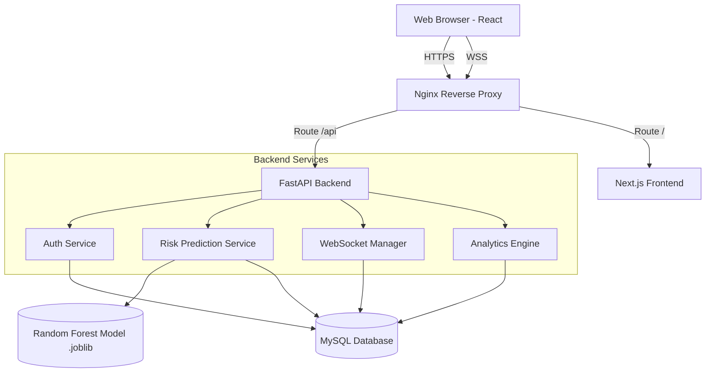
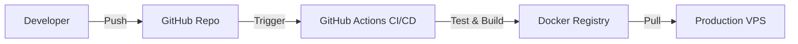

# Architecture Documentation

This document visualizes the high-level architecture of the EduRisk Platform.

## High-Level Component Diagram

## Layer Breakdown

### 1. Reverse Proxy (Nginx)
Handles incoming traffic, SSL termination, and routes requests to appropriate Docker containers based on the URI path.

### 2. Frontend (React/Next.js)
A Single Page Application (SPA) utilizing Tailwind CSS for styling and Recharts for data visualization. State is managed via React Context and Hooks.

### 3. Backend (FastAPI)
The core application server. It heavily utilizes FastAPI's Dependency Injection system to pass database sessions (`get_db`) and current users (`get_current_user`) to route handlers. 

### 4. Machine Learning (Scikit-Learn)
Embedded directly into the FastAPI process using `joblib`. While this couples ML and API, it eliminates network latency for predictions, yielding <50ms inference times.

### 5. Database (MySQL 8.0)
A normalized relational database ensuring data integrity through foreign keys and constraints.

## DevOps Architecture

