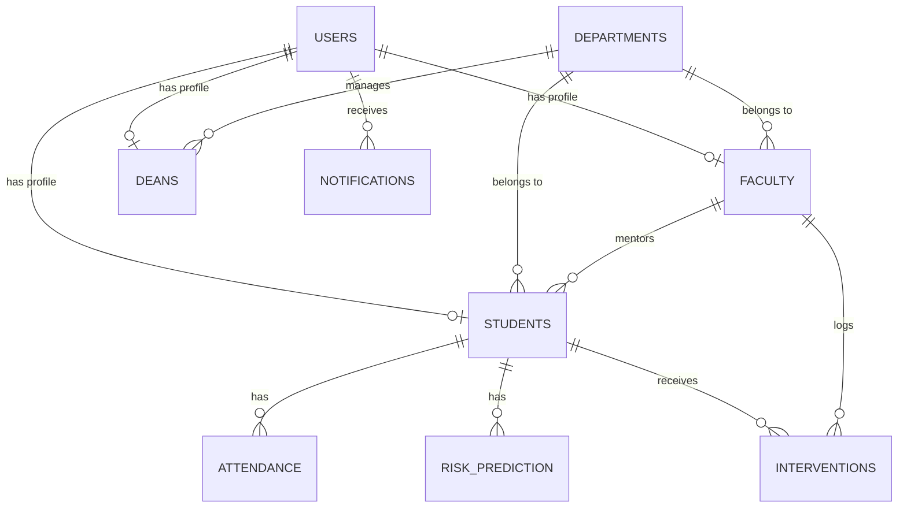

# Database Documentation

The EduRisk database is built on MySQL 8.0 and utilizes SQLAlchemy as its ORM. The database is heavily normalized to ensure data integrity.

## Entity-Relationship Overview

## Tables Details

### 1. `users`
Central authentication and RBAC table.
- **id** (Integer, PK): Unique identifier.
- **email** (String, Unique): Login credential.
- **hashed_password** (String): Bcrypt hashed password.
- **role** (Enum): `student`, `faculty`, `dean`.
- **is_active** (Boolean): Account status.

### 2. `departments`
Academic organizational units.
- **id** (Integer, PK)
- **name** (String, Unique): e.g., "Computer Science"

### 3. `students`
Student demographic and academic profile.
- **id** (Integer, PK)
- **user_id** (Integer, FK -> `users.id`, Unique)
- **department_id** (Integer, FK -> `departments.id`)
- **faculty_advisor_id** (Integer, FK -> `faculty.id`)
- **cgpa** (Float): Current CGPA.
- **credits_completed** (Integer)

### 4. `faculty`
Faculty and mentor records.
- **id** (Integer, PK)
- **user_id** (Integer, FK -> `users.id`, Unique)
- **department_id** (Integer, FK -> `departments.id`)

### 5. `attendance`
Historical attendance records.
- **id** (Integer, PK)
- **student_id** (Integer, FK -> `students.id`)
- **date** (Date)
- **status** (String): `Present`, `Absent`, `Late`.

### 6. `risk_predictions`
AI-generated risk scores and explanations.
- **id** (Integer, PK)
- **student_id** (Integer, FK -> `students.id`)
- **risk_score** (Float): 0.0 to 100.0.
- **risk_factors** (JSON): Top SHAP factors.
- **predicted_at** (DateTime)

### 7. `interventions`
Actions taken by faculty to assist at-risk students.
- **id** (Integer, PK)
- **student_id** (Integer, FK -> `students.id`)
- **faculty_id** (Integer, FK -> `faculty.id`)
- **type** (String): e.g., `Meeting`, `Warning`, `Counseling`.
- **notes** (Text)
- **status** (String): `Pending`, `Completed`.

### 8. `notifications`
System alerts for users.
- **id** (Integer, PK)
- **user_id** (Integer, FK -> `users.id`)
- **message** (String)
- **is_read** (Boolean)
- **created_at** (DateTime)
